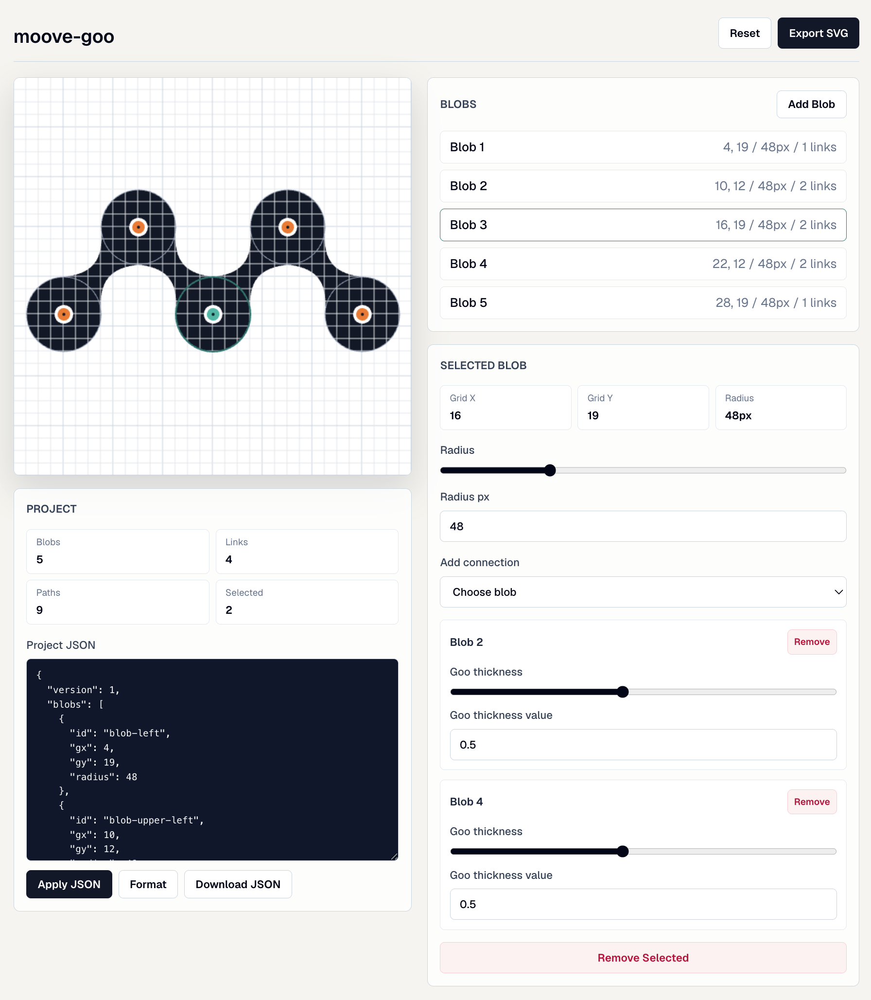

# moove-goo

A compact browser-based logo generator for drawing connected goo blobs on a fluid 32 x 32 grid canvas, with fixed 512 x 512 vector SVG export.



## Features

- Fluid p5 canvas with a 32 x 32 marker grid
- Add, select, drag, resize, and remove blobs
- Connect blobs with independently adjustable goo bridge thickness
- Load, edit, format, apply, download, and revert project JSON drafts
- Persist projects locally with Zustand and localStorage
- Export drawings as fixed 512 x 512 vector SVG paths

## Getting Started

```bash
pnpm install
pnpm dev
```

Open `http://localhost:3000`.

## Projects

Changes to the applied project are saved automatically in this browser.
Use **Download JSON** to keep or share a portable `goo-project.json` file.

- **Load JSON** reads a file into the editor draft. The canvas changes only after **Apply JSON**.
- **Apply JSON** validates the draft and updates the canvas. **Cmd/Ctrl + Enter** also applies it.
- **Format** validates and formats the draft without applying it.
- **Download JSON** saves the applied project, including when the draft has unapplied edits.
- **Revert edits** discards the draft and shows the current applied project JSON.
- **Restore defaults** resets the project, updates browser storage, and clears the draft.
- **Download SVG** saves the current drawing as a vector `goo-blobs.svg` file.

A clean JSON editor follows canvas changes. Once edited or loaded, the draft stays
separate until applied or reverted. Invalid JSON leaves the current drawing intact.

## Project Format

Projects use this JSON shape:

```ts
type GooProject = {
  version: 1;
  blobs: {
    id: string;
    gx: number;
    gy: number;
    radius: number;
  }[];
  connections: {
    id: string;
    aId: string;
    bId: string;
    gooThickness: number;
  }[];
};
```

## Files

- `app/page.tsx` renders the editor route.
- `app/editor.tsx` contains the client editor and p5 integration.
- `app/blobs.ts` contains pure geometry and SVG path generation.
- `app/project.ts` contains schema validation and project serialization.
- `app/store.ts` contains persisted Zustand state.
